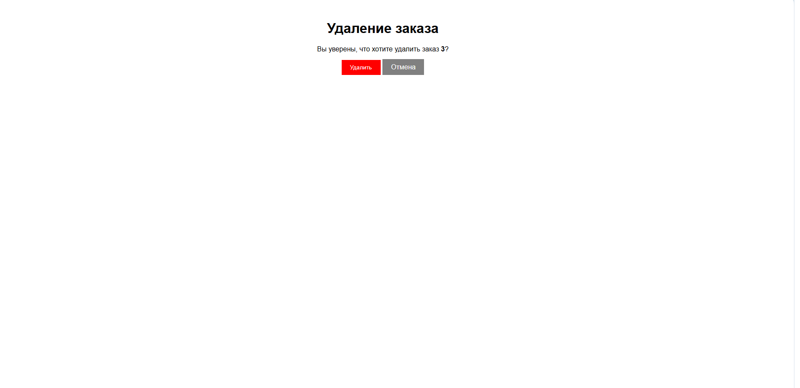

# Система управления заказами в кафе

## Описание
Это тестовое веб-приложение на Django, предназначенное для управления заказами в кафе — как через веб-интерфейс, так и через API. Приложение позволяет: 
 - добавлять заказы.
 - отображать заказы.
 - изменять заказы.
 - удалять заказы.
 - искать заказы.
 - просматривать выручку.

В нём также есть pytest-тесты (для проверки API-запросов). 

## Установка и настройка

#### 1. Клонирование репозитория

```bash
git clone https://github.com/werwolf333/iikoLike.git
```
#### 2. Перейдите в директорию проекта:
```bash
cd iikoLike
```

#### 3. Настройка виртуального окружения

```bash
python3 -m venv .venv
source .venv/bin/activate
```
#### 4. Установите все необходимые пакеты, перечисленные в requirements.txt:

```bash
pip install -r requirements.txt
```
#### 5. Настройка базы данных
Примените миграции для создания структуры базы данных:
```bash
python manage.py migrate
```


## Стек технологий

Использовал что требовалось по ТЗ.
- Python 3.x
- Django 5.x
- HTML/CSS 
- SQLite
- Bootstrap (добавил, это небольшое добавление)

Хотелось добавить DRF (Django REST framework), но сдержался, не стал, так как в ТЗ не было указано. Хотел завернуть проект в докер, показав его знание, но думаю избыточно, тут хватит venv так как только питон библиотеки используються.


## Запуск и использование проекта

После выполнения всех настроек, запустите локальный сервер разработки:

```bash
python manage.py runserver
```
Откройте в браузере http://127.0.0.1:8000/orders/ где вы увидите основное окно со списком заказов который в данный момент будет пустым.


нажмите на кнопку "добавить новый заказ" и перейдёте на страницу, где вы можете указать столик, и блюда (Число блюд должно быть больше одного). У блюда вы можете указать название, цену и количество. 
p.s. Невалидные данные не пройдут (валидация на стороне клиента).


после заполнения данных заказа, нажмите кнопку "добавить заказ", после чего вы снова будете на странице списка заказов.


Тут можно отфильт по статусу или номеру столика.


Можно поменять прямо в списке заказов статус при помощи выподающего меню и сохранив изменния нажав кнопку рядом "изменить".

А можно нажав на кнопку редактирования изменить все данные заказа.


После сохранения изменения вы так же перейдёте на основную страницу со списком заказов.

При удалении заказа, вы перейдёте на страницу подтверждения.



так же есть на главной странице кнопка "подсчёт выручки" что перенесёт вас на отдельную страницу. Где будет указана оплеченные заказы.
p.s. добавил недельные и месячсные что бы не было так пусто на странице. (Оно расчитываетья опираясь на дату создания заказа и текущей даты).


Для обработки ошибок веб-интерфейса реализована кастомная страница 404: при некорректном запросе (удалении/редактирования) пользователю предлагается нажать кнопку для возврата на главную страницу.


p.p.s. Отображения данных отдельно одного заказа, в веб-интфейсе не стал делать, оно избыточно в списке и так всё отображаю. Думал может добавить модальные окна где-нибудь, но не стал. 
В тестах подробно в коментариях описано что делают, загляните почитайте в папке tests.